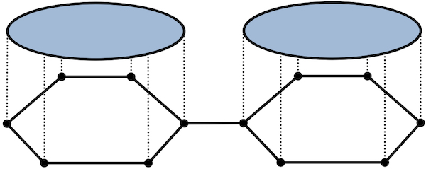
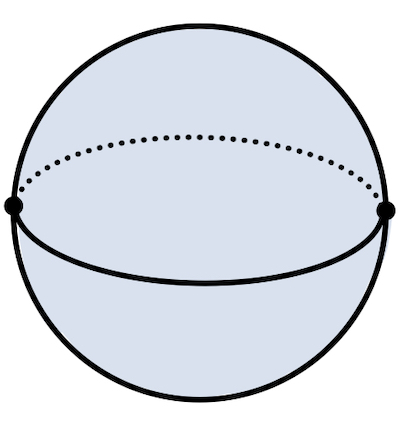
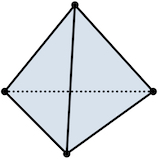

# CW Networks


This repository contains the official code used for the papers
**[Weisfeiler and Lehman Go Cellular: CW Networks](https://arxiv.org/abs/2106.12575) (NeurIPS 2021)**
and **[Weisfeiler and Lehman Go Topological: Message Passing Simplicial Networks](https://arxiv.org/abs/2103.03212) (ICML 2021)**

&nbsp;&nbsp;&nbsp;&nbsp;  &nbsp;&nbsp;  

*Graph Neural Networks (GNNs) are limited in their expressive power, struggle with long-range 
interactions and lack a principled way to model higher-order structures. These problems can be 
attributed to the strong coupling between the computational graph and the input graph structure. 
The recently proposed Message Passing Simplicial Networks naturally decouple these elements 
by performing message passing on the clique complex of the graph. Nevertheless, 
these models are severely constrained by the rigid combinatorial structure of 
Simplicial Complexes (SCs). In this work, we extend recent theoretical results on SCs to 
regular Cell Complexes, topological objects that flexibly subsume SCs and graphs. 
We show that this generalisation provides a powerful set of graph "lifting" transformations, 
each leading to a unique hierarchical message passing procedure. The resulting methods, 
which we collectively call CW Networks (CWNs), are strictly more powerful than the WL test and, 
in certain cases, not less powerful than the 3-WL test. In particular, we demonstrate the 
effectiveness of one such scheme, based on rings, when applied to molecular graph problems. 
The proposed architecture benefits from provably larger expressivity than commonly used GNNs, 
principled modelling of higher-order signals and from compressing the distances between nodes. 
We demonstrate that our model achieves state-of-the-art results on a variety of molecular datasets.*

## Installation

We use `Python 3.8` and `PyTorch 1.7.0` on `CUDA 10.2` for this project.
Please open a terminal window and follow these steps to prepare the virtual environment needed to run any experiment.

Create the environment:
```shell
conda create --name cwn python=3.8
conda activate cwn
conda install pip # Make sure the environment pip is used
```

Install dependencies:
```shell
sh graph-tool_install.sh
conda install -y pytorch=1.7.0 torchvision cudatoolkit=10.2 -c pytorch
sh pyG_install.sh cu102
pip install -r requirements.txt
```

### Testing

We suggest running all tests in the repository to verify everything is in place. Run:
```shell
pytest -v .
```
All tests should pass. Note that some tests are skipped since they rely on external
datasets or take a long time to run. We periodically run these additional tests manually.  

## Experiments 

We prepared individual scripts for each experiment. The results are written in the
`exp/results/` directory and are also displayed in the terminal once the training is
complete. Before the training starts, the scripts will download / preprocess the corresponding graph datasets 
and perform the appropriate graph-lifting procedure (this might take a while).

### Molecular benchmarks

To run an experiment on a molecular benchmark with a CWN, execute:
```shell
sh exp/scripts/cwn-<benchmark>.sh
```
with `<benchmark>` one amongst `zinc`, `zinc-full`, `molhiv`.

Imposing the parameter budget: it is sufficient to add the suffix `-small` to the `<benchmark>` placeholder:
```shell
sh exp/scripts/cwn-<benchmark>-small.sh
```
For example, `sh exp/scripts/cwn-zinc-small.sh` will run the training on ZINC with parameter budget.

### Distinguishing SR graphs

To run an experiment on the SR benchmark with a CWN, run:
```shell
sh exp/scripts/cwn-sr.sh <k>
```
replacing `<k>` with a value amongst `4`, `5`, `6` (`<k>` is the maximum ring size employed in the lifting procedure). The results, for each family, will be written under `exp/results/SR-cwn-sr-<k>/`.

The following command will run the MLP-sum (strong) baseline on the same ring-lifted graphs:
```shell
sh exp/scripts/cwn-sr-base.sh <k>
```

In order to run these experiment with clique-complex lifting (MPSNs), run:
```shell
sh exp/scripts/mpsn-sr.sh
```
Clique-lifting is applied up to dimension `k-1`, with `k` the maximum clique-size in the family.

The MLP-sum baseline on clique-complexes is run with:
```shell
sh exp/scripts/mpsn-sr-base.sh
```

### Circular Skip Link (CSL) Experiments

To run the experiments on the CSL dataset (5 folds x 20 seeds), run the following script:
```shell
sh exp/scripts/cwn-csl.sh
```

### Trajectory classification

For the Ocean Dataset experiments, the data must be downloaded from [here](https://github.com/nglaze00/SCoNe_GCN/blob/master/ocean_drifters_data/dataBuoys.jld2).
The file must be placed in `datasets/OCEAN/raw/`. 

For running the experiments use the following scripts:
```shell
sh ./exp/scripts/mpsn-flow.sh [id/relu/tanh]
sh ./exp/scripts/mpsn-ocean.sh [id/relu/tanh]
sh ./exp/scripts/gnn-inv-flow.sh
sh ./exp/scripts/gnn-inv-ocean.sh
```

### TUDatasets

For experiments on TUDatasets first download the raw data from [here](https://www.dropbox.com/s/2ekun30wxyxpcr7/datasets.zip?dl=0).
Please place the downloaded archive on the root of the repository and unzip it (e.g. `unzip ./datasets.zip`).

Here we provide the scripts to run CWN on NCI109 and MPSN on REDDITBINARY. This script can be customised to run additional experiments on other datasets.
```shell
sh ./exp/scripts/cwn-nci109.sh
sh ./exp/scripts/mpsn-redditb.sh
```

### Credits

For attribution in academic contexts, please cite the following papers

```
@inproceedings{pmlr-v139-bodnar21a,
  title = 	 {Weisfeiler and Lehman Go Topological: Message Passing Simplicial Networks},
  author =       {Bodnar, Cristian and Frasca, Fabrizio and Wang, Yuguang and Otter, Nina and Montufar, Guido F and Li{\'o}, Pietro and Bronstein, Michael},
  booktitle = 	 {Proceedings of the 38th International Conference on Machine Learning},
  pages = 	 {1026--1037},
  year = 	 {2021},
  editor = 	 {Meila, Marina and Zhang, Tong},
  volume = 	 {139},
  series = 	 {Proceedings of Machine Learning Research},
  month = 	 {18--24 Jul},
  publisher =    {PMLR},
}
```

```
@inproceedings{neurips-bodnar2021b,
  title={Weisfeiler and Lehman Go Cellular: CW Networks},
  author={Bodnar, Cristian and Frasca, Fabrizio and Otter, Nina and Wang, Yu Guang and Li{\`o}, Pietro and Mont{\'u}far, Guido and Bronstein, Michael},
  booktitle = {Advances in Neural Information Processing Systems},
  volume = {34},
  year={2021}
}
```

## TODOs

- [ ] Add support for coboundary adjacencies. 
- [ ] Refactor the way empty cochains are handled for batching.
- [ ] Remove redundant parameters from the models 
  (e.g. msg_up_nn in the top dimension.)   
- [ ] Refactor data classes so to remove setters for `__num_xxx_cells__` like attributes.
- [ ] Address other TODOs left in the code.
